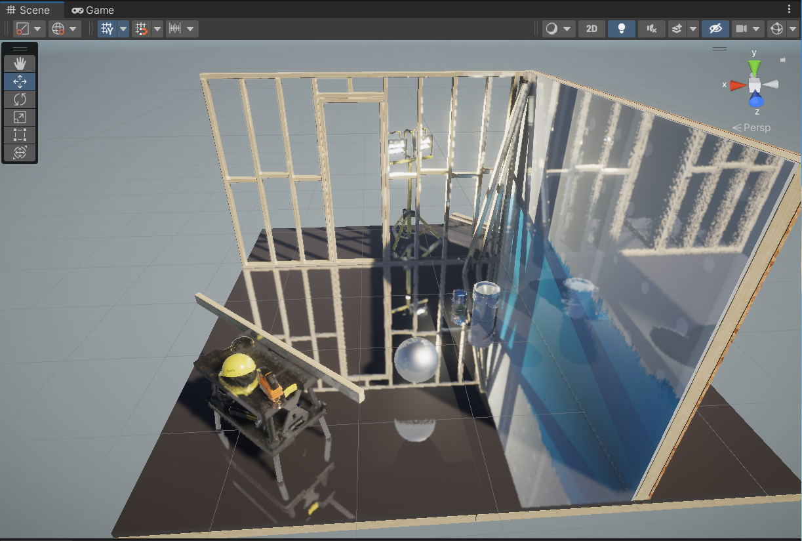

# ScreenSpaceReflection-URP
A Screen Space Reflection implementation in Unity Universal Render Pipeline(URP)

# Features
- Compatible with deferred rendering in URP
- Screen space RayMarching
- Binary search speed up

# Requirements
Unity 2021.3.15 or later

Dx11+ or Vulkan1.3 compatible GPU

# Blog
https://zhuanlan.zhihu.com/p/647921448

# References
[Unity Universal Render Pipeline Manual](https://docs.unity3d.com/Packages/com.unity.render-pipelines.universal@16.0/manual/)

[Efficient GPU Screen-Space Ray Tracing](https://www.gdcvault.com/play/1022186/Efficient-GPU-Screen-Space-Ray)